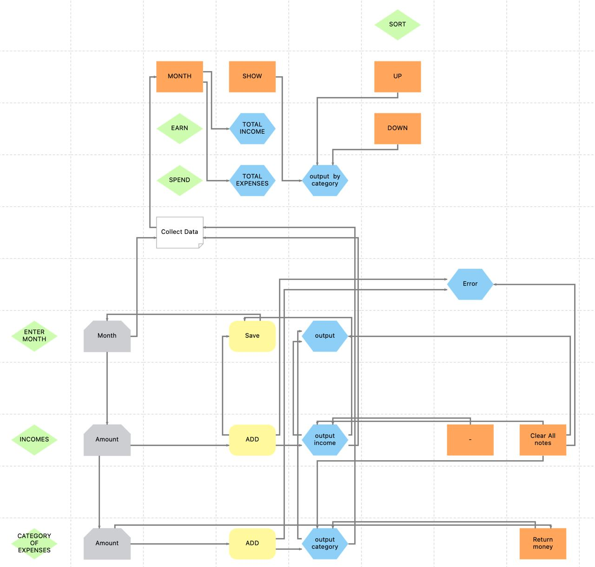

# Btracker - трекер бюджета

Над проектом работали: [Максим Аверкин](https://github.com/Maxoverking), [Марина Погребняк](https://github.com/MarynaPogrebniak), [Дина Мигунова](https://github.com/melondina) в рамках курса "Базовое программирование"

Руководитель: Кирилл Шнырёв
### Функционал приложения:
- Записывает расходы, доходы, бюджет по месяцам;
- Выводит результаты подсчетов на экран;
- Ведется статистика за каждый месяц;
- Сортировка расходов по конкретному месяцу.
### Точка входа:
Запустить приложение можно через [Main.java](src/main/java/com/example/btracker/Main.java)
### Руководство пользователя:
- В поле Month введите месяц;
- Заполните поля по категориям и нажмите кнопку Add:
  - Введенная сумма отображается на экране рядом с этой кнопкой; 
  - В поле budget выводится разница между доходами и расходами по выбранному месяцу.
- Для удаления необходимой суммы из категории расходов:
  - Введите сумму, которую хотите удалить, и нажмите кнопку Return money.
- Для очищения категории доходов нажмите кнопку со знаком " - ".
- После введения всех данных нажмите Save changes:
  - В верхней части приложения выведется сумма доходов и расходов по этому месяцу;
  - Появится кнопка Show.
- Для вывода расходов по категориям за этот месяц нажмите на кнопку Show.
- Для сортировки расходов по возрастанию или убыванию нажмите кнопку Sort.
- Чтобы перейти к заполнению данных для нового месяца нажмите кнопку Clear all notes.
### Техническая документация:
Для разработки приложения использована платформа JavaFX
#### Схема работы приложения:

#### Архитектура приложения - классы и методы (краткое описание):
- [Main.java](src/main/java/com/example/btracker/Main.java)- запуск приложения;
- [MainController.java](src/main/java/com/example/btracker/MainController.java) - взаимодействие всех элементов приложения;
- [Calculation.java](src/main/java/com/example/btracker/allClasses/Calculation.java) - методы для подсчета расходов, общего бюджета:
  - calculateBudget - подсчет общего бюджета;
  - calculateBudgeReturn - подсчет общего бюджета после удаления суммы из категории;
  - addMoney - подсчет расходов по одной категории;
  - returnMoney - подсчет расходов по одной категории после удаления суммы из этой категории;
  - calcEarnAndSpendForMonth - подсчет доходов и расходов за весь месяц и вывод на экран.
- [GetMonthAndIncome.java](src/main/java/com/example/btracker/allClasses/GetMonthAndIncome.java) - конструктор для дохода и месяца;
- [NewAmountIncome.java](src/main/java/com/example/btracker/allClasses/NewAmountIncome.java) - конструктор для дохода;
- [CollectData.java](src/main/java/com/example/btracker/collectData/CollectData.java) - сбор данных по расходам и доходам за выбранный месяц;
- [CorrectMonth.java](src/main/java/com/example/btracker/correctMonth/CorrectMonth.java) - проверка корректности ввода месяца;
- [CustomException.java](src/main/java/com/example/btracker/exception/CustomException.java) - ошибки неправильного ввода;
- [OperationBtnAction.java](src/main/java/com/example/btracker/sameOperation/OperationBtnAction.java) - методы, выводящие на экран информацию:
    - showButtonsAction - вывод расходов по категории;
    - showButtonsMonthAction - вывод расходов и доходов за выбранный месяц.
- [StyleBtns.java](src/main/java/com/example/btracker/sameOperation/StyleBtns.java) - стиль кнопок;
- [AddToField.java](src/main/java/com/example/btracker/sortingData/AddToField.java) - вывод данный после сортировки;
- [Theme.java](src/main/java/com/example/btracker/theme/Theme.java) - изменение цвета окна приложения;
- [SortingData.java](src/main/java/com/example/btracker/sortingData/SortingData.java) - сортировка расходов;
- [tests](src/main/java/com/example/btracker/tests) - Юнит-тесты для методов:
  - Тесты на проверку правильности вычислений и выброса ошибок:
    - [AddMoneyTests.java](src/main/java/com/example/btracker/tests/AddMoneyTests.java);
    - [CalculateBudgetReturnTests.java](src/main/java/com/example/btracker/tests/CalculateBudgetReturnTests.java);
    - [CalculateBudgetTests.java](src/main/java/com/example/btracker/tests/CalculateBudgetTests.java);
    - [ReturnMoneyTests.java](src/main/java/com/example/btracker/tests/ReturnMoneyTests.java);
  - Тест на корректность ввода месяца: 
    - [CorrectMonthTests.java](src/main/java/com/example/btracker/tests/CorrectMonthTests.java).
  - Тест на заполнение данных:
    - [CollectDataTests.java](src/main/java/com/example/btracker/tests/CollectDataTests.java).
  - Тест на сортировку:
    - [SortingDataTests.java](src/main/java/com/example/btracker/tests/SortingDataTests.java).
- [my-budget.fxml](src/main/resources/com/example/btracker/my-budget.fxml) - разметка приложения.
